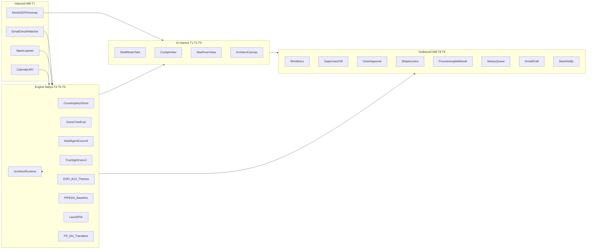

# Gambit — Architecture

## Locked stack

| Layer | Choice |
|-------|--------|
| Framework | Next.js 15 (App Router), TypeScript strict |
| UI | React 19, Tailwind CSS v4, shadcn/ui |
| Viz | `@xyflow/react` (React-Flow) — game tree + Architect canvas |
| Motion | `framer-motion` or `motion` (per `design.MD` §14) |
| LLM | Anthropic Claude (Messages API), structured outputs where possible |
| Auth / Google | NextAuth.js v5 + Google provider (Gmail read/draft, Calendar) |
| Slack | Incoming webhooks (notify) + optional Events API / slash for demo |
| Doc gen | `docx` (npm) for `.docx`; `@react-pdf/renderer` for Supervisor PDF |
| Payments | Stripe API (test mode), **currency CAD** for Initech demo |
| Legal verify | CanLII search / scrape strategy documented in T6 |
| i18n | `next-intl` or lightweight locale context + Cloud Translation API |
| Deploy | Vercel (env vars in dashboard) |

**Do not edit** root `design.MD` — consume tokens from it in T1.

---

## Repository layout (target after Sprint 0 on `main`)

```
aixlaw/
├── Example Scenario (Optional)/   # Spellbook fixtures — READ-ONLY in hackathon
├── HeroVideo.MD                  # Single allowed marketing hero video URL
├── app/
│   ├── (marketing)/              # Landing, Sarah cold open (T1) — <video src> from HeroVideo.MD
│   ├── (app)/
│   │   ├── cockpit/
│   │   ├── war-room/
│   │   └── architect/
│   └── api/
├── src/
│   ├── components/
│   ├── lib/
│   │   ├── contracts/
│   │   ├── engine/
│   │   ├── integrations/
│   │   └── fixtures/             # Parsed JSON + canned tree (not a copy of Spellbook .md edits)
│   └── hooks/
├── public/
│   └── demo/
├── docs/
└── design.MD
```

Sprint 0 on `main` creates empty stubs + `src/lib/contracts/*` so feature branches rebase cleanly.

---

## System diagram



---

## Data flow (happy path)

1. **Inbound:** Gmail/Slack/classifier emits `InboundEvent` → `DealSession` built from `Example Scenario (Optional)/` paths.
2. **Engine:** `GhostEngine.generate` → `TreeEngine.bloom` → `ComplianceService.checkProposedText` on draft snippets → UI subscribes via SSE or polling.
3. **User action:** “Play Best Line” → `Decision` object → `WorkProduct.docx` + `WorkProduct.supervisorPdf` + `ExecutionEngine.fire`.
4. **Outbound:** Timeline events stream to Cockpit footer; Slack + Gmail draft complete the arc.

---

## Hero video (T1)

- Marketing hero **must** use the exact URL in root [`HeroVideo.MD`](../HeroVideo.MD) (CloudFront). No re-hosting unless the team explicitly changes that file.

---

## Environment variables (reference)

| Variable | Owner | Purpose |
|----------|-------|---------|
| `ANTHROPIC_API_KEY` | Aditya | Claude |
| `GOOGLE_CLIENT_ID` / `SECRET` | Will | NextAuth Google |
| `NEXTAUTH_SECRET` | Will | Session |
| `SLACK_WEBHOOK_URL` / signing secret | Will | Outbound + verify inbound |
| `STRIPE_SECRET_KEY` | Will | Test invoices (**CAD**) |
| `GOOGLE_CLOUD_TRANSLATION_KEY` or service account JSON | Aditya | FR/EN |
| `CANLII_*` or generic HTTP proxy | Aditya | TrueSight |
| `SPELLBOOK_API_KEY` (optional) | Will | Real Spellbook vs fixture |

Never commit secrets; use `.env.local` (gitignored).

---

## Task → code ownership

| Task | Primary paths |
|------|----------------|
| T1 | `app/(marketing)`, `src/components/ui`, layout, i18n shell |
| T2 | `app/(app)/cockpit`, `src/components/cockpit` |
| T3 | `app/(app)/war-room`, `architect`, `src/components/war-room`, `architect` |
| T4–T6 | `src/lib/engine/*`, `app/api/engine/*` |
| T7–T9 | `src/lib/integrations/*`, `app/api/integrations/*` |

---

## Deployment

- **Vercel:** connect repo, set env vars, Node 20+.  
- **API routes:** default serverless; long-running Council stream may use Edge-compatible patterns or chunk responses.  
- **Google OAuth:** authorized redirect URIs must include Vercel preview + production URLs.

---

## Non-goals (architecture)

- No separate Python service (stack lock: pure Next.js).  
- No editing `design.MD`.  
- No editing Spellbook source files under `Example Scenario (Optional)/` (read-only fixtures).  
- Production-scale firm vault ingestion — out of scope; demo uses **synthetic** Initech precedent JSON (T4).
